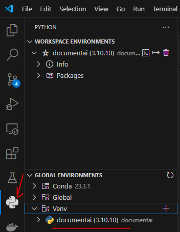
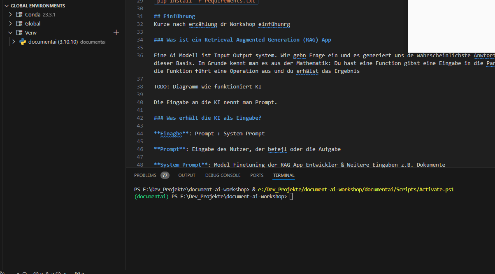

# document-ai-workshop (Work in progress)
Das hier ist das Repository zu einen Workshop.  

**GOAL** Wir werden eine [Retrieval Augmented Generation (RAG)](https://python.langchain.com/v0.2/docs/tutorials/rag/) App in Langchain bauen.  
Als zusätzliche Funktionen sind geplant
- Chat mit Dokumenten
- Chat Historie
- Gradio Chat Interface   

TODO: english version  
## Environment Setup

Install Python 3.10: https://www.python.org/downloads/release/python-31011/ or via [Microsoft Store](https://apps.microsoft.com/detail/9pjpw5ldxlz5?hl=en-US&gl=US)

Install Ollama (**only for local AI Models**, needs a good processor or a graphics card)

Folgendes Schritte musst du im Terminal ausführen, dabei solltest du dich im Projekt Directory befinden


Setup Virtual Environment (venv) in terminal ():  
```python -m venv documentai```  
Hier werden wir die Pakete in ein abgeschirmten Umgebung installieren.  
Aktiviere das um die Pakete nutzen zu können. Das kannst du in der Python Tab machen.  
Setzte bitte in Python Tab in VS Code die angelegte venv als Ausführungsenvironment, damit du Python Scipte in VSCode über das Play Symbol im venv ausführen kannst.  
  
Hier kannst du auch einen Terminal in dem venv öffnen  


Installiere benötigte Abhängigkeiten mit dem Befehl:
`pip install -r requirements.txt`

## Einführung 

### Was ist ein Retrieval Augmented Generation (RAG) App

Eine Ai Modell ist Input Output system. Wir gebn Frage ein und es generiert uns de wahrscheinlichste Anwtort auf dieser Basis. Im Grunde kennt man es aus der Mathematik: Du hast eine Function gibst eine Eingabe in die Paramter, die Funktion führt eine Operation aus und du erhälst das Ergebnis

TODO: Diagramm wie funktioniert KI

Die Eingabe an die KI nennt man Prompt.

### Was erhält die KI als Eingabe?

**Einagbe**: Prompt + System Prompt

**Prompt**: Eingabe des Nutzer, der Befehl oder die Aufgabe

**System Prompt**: Model Finetuning der RAG App Entwickler & Weitere Eingaben z.B. Dokumente  
Das Model finetuning kann z.B. Auflagen für das KI Modell sein, auf die Eingabe auf bestimmte Arten zu beantworten oder die Anfragen im Prompt in eine bestimmte Licht zu sehen. Genauso kann man hier versuchen dem Modell bestimmtes Verhalten zu verbieten. 

Und dann wären da noch die [LLM Konfigurations-Hyperparameter](https://learnprompting.org/de/docs/basics/configuration_hyperparameters), im Grunde genommen zahlenbasierte Stellschrauben, um die Ausgabe des Modells weiter zu beeinflussen.

### Get an OpenAI API Key
TODO: Übersetzen
- First, navigate to https://platform.openai.com/account/api-keys
- Then, sign up for or sign into your OpenAI account.
- Click the Create new secret key button. It will pop up a modal that contains a string of text like this:

- Last, create in project-root a new file `my_gpt.key` and paste your key into it. (so you can use helper function: loadGptKey)

 Note that OpenAI charges you for each prompt you submit through these embeds. If you have recently created a new account, you should have 3 months of free credits. If you have run out of credits, don't worry, since using these models is very cheap. ChatGPT only costs about $0.02 for every seven thousand words you generate. from [learnprompting.org](https://learnprompting.org/de/docs/basics/embeds)

## Tools
### Langchain: 
TODO: Ausführlicher
[How Tos](https://python.langchain.com/v0.2/docs/how_to/#tools)

### Gradio: Simple Web GUI for via Python Commands for Ai interaction
[Create a Chatbot with Gradio](https://www.gradio.app/guides/creating-a-chatbot-fast#using-your-chatbot-via-an-api)

[Ergänze Multimodale features zum Interface](https://www.gradio.app/guides/creating-a-chatbot-fast#add-multimodal-capability-to-your-chatbot) zum Beispiel File Upload

### Running Local LLM with Ollama
Abhängigkeiten bereits installiert.


1. Install Ollama: https://ollama.com/download 
2. [Browse Models](https://ollama.com/library) for your use Case or use a recommendation model
3. Load Model via `ollama pull <model>`
4. Serve Model locally via `ollama run <model>`
5. Run ``python run_ai_ollama_model.py``


[Anleitung Chat Einrichtung](https://python.langchain.com/v0.2/docs/integrations/chat/ollama/)
[Multi Modal Support](https://python.langchain.com/v0.2/docs/integrations/llms/ollama/#multi-modal)
[Using Model Tools (if exist)](https://python.langchain.com/v0.2/docs/integrations/chat/ollama/#tool-calling)
[Tooling with few Shoot Ansatz](https://python.langchain.com/v0.2/docs/how_to/tools_few_shot/)

### Recommendations

- [Mistral](https://ollama.com/library/mistral)
- [LLama3 by Meta](https://ollama.com/library/llama3.1)
- [gemma2 by Google](https://ollama.com/library/gemma2)

## Prompt Techniken: Wie interagiere ich effektiv mit der AI
Die Webseite [learnprompting.org](https://learnprompting.org/de/docs) erklärt wie Prompting funktioniert und stellt Ansätze dar wie man der KI aus der Perspektive der Prompt Eingabe bessere Ergebnisse entlocken kann. 

### Few Shot Prompting
[Was ist few Shot Prompting?](https://learnprompting.org/de/docs/basics/few_shot)
In der Praxis dieses Workshops werden wir Few Shot Prompting verwenden, um in dem System Prompt dem KI Modell einen grobe Situation vorgegen. Im Grunde nur darum geht, dem Modell einige Beispiele für das zu zeigen bzw. Anweisungen zeigen (sogenannte Shots), was es tun soll.  
[Few Shot Prompting in Langchain](https://python.langchain.com/v0.2/docs/how_to/structured_output/#few-shot-prompting)

### Rollen Prompting


