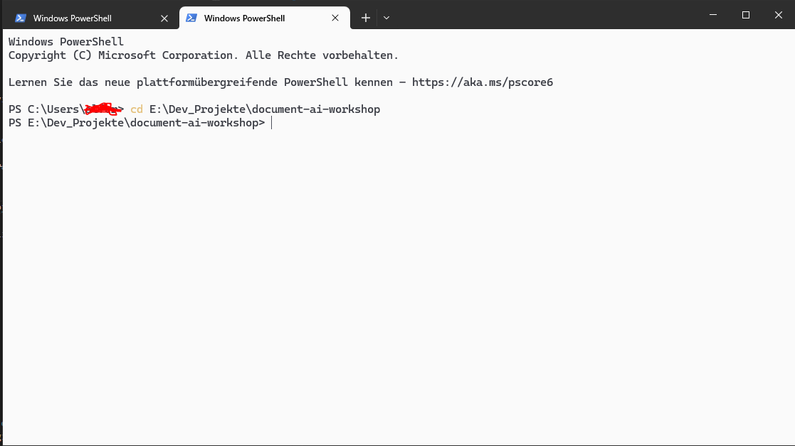
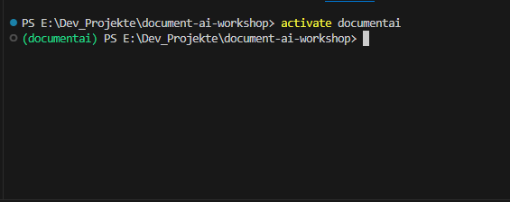
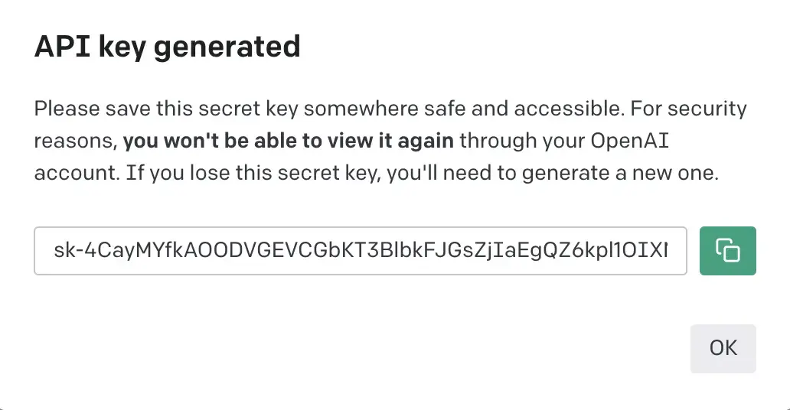
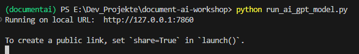
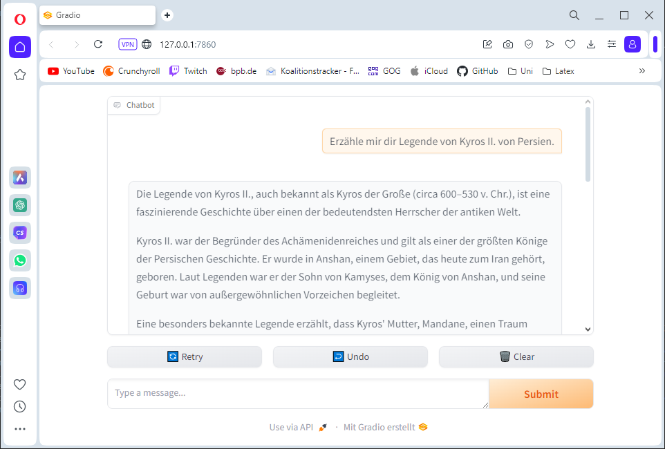
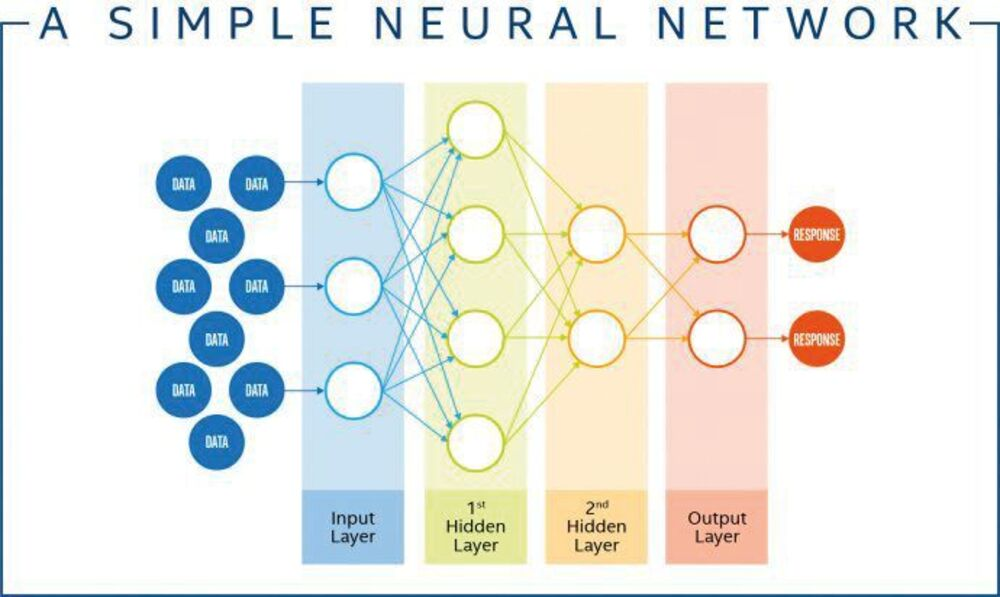
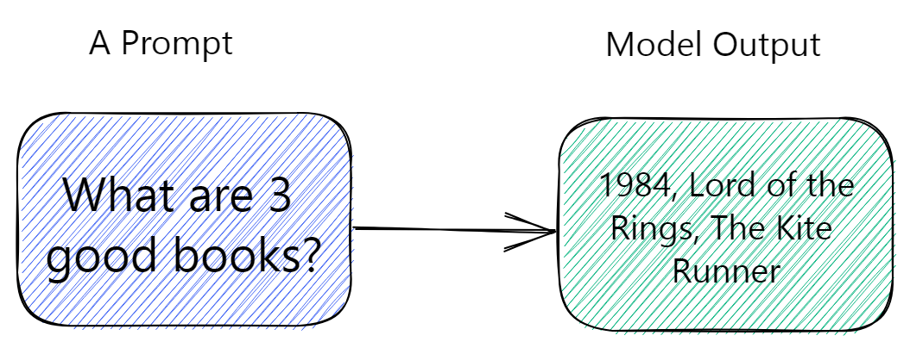
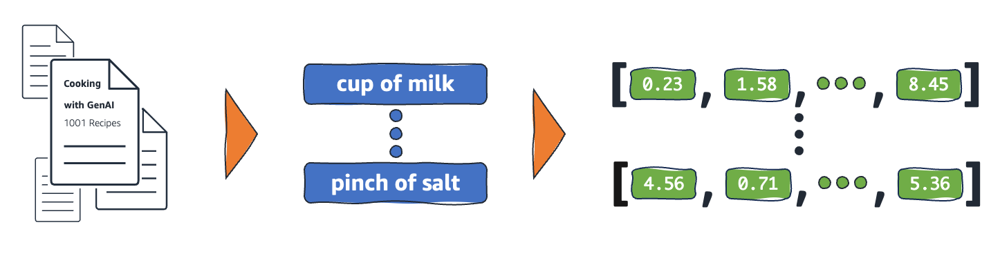

# document-ai-workshop (Work in progress)
Das hier ist das Repository zu einen Workshop.  

**GOAL** Wir werden eine [Retrieval Augmented Generation (RAG)](https://python.langchain.com/v0.2/docs/tutorials/rag/) App in Langchain bauen. In einfachen Worten einen ChatBot, dem wir zusätzliches Wissen zu Verfügung stellen werden.  
Als Funktionen sind geplant
- Chat mit Dokumenten (ChatBot der Wissen aus Dokumenten ziehen kann)
- (Chat Historie) Fertig
- (Graphical Chat Interface) Fertig

Das Repository stellt eine simple Ki Applikation mit einer GUI zur Verfügung. Es eine Anleitung zum Setup und eine kurze Einführung in das Thema mit Links. 

TODO: english version  
## Environment Setup

Install Python 3.10: [python.org](https://www.python.org/downloads/release/python-31011/) oder via [Microsoft Store](https://apps.microsoft.com/detail/9pjpw5ldxlz5?hl=en-US&gl=US)

Folgende Schritte musst du im Terminal ausführen, dafür solltest du dich im Projekt Ordner befinden


Setup **Virtual Environment (venv)** in terminal:  
```python -m venv documentai```  
Hier werden wir die Pakete in ein abgeschirmten Umgebung installieren, dem "venv".

Nun müssen wir das venv *documentai* im terminal aktivieren.
```activate documentai``` (Bei Fehler Terminal neustarten)  
*Wichtig!* Die KI Applikation wird sich nur in der Konsole ausführen lassen, wenn das Venv aktiv ist!
  
(*Alternative*) venv via [VSCode Plugin Python EnvironManager](https://marketplace.visualstudio.com/items?itemName=donjayamanne.python-environment-manager) erstellen & aktivieren  
(*Alternative*) venv via [VSCODE Commands (+ Erklärungen)](https://code.visualstudio.com/docs/python/environments) aktivieren

Installiere benötigte Abhängigkeiten & Pakete mit dem Befehl:
`pip install -r requirements.txt`

Die KI Applikation ist jetzt fast bereit zum ausführen. Es gibt zwei Varianten:
- OpenAi Playground basierte Ki Applikation (*Cloud* KI Modell) `python run_ai_gpt_model.py`
- Ollama basierte Ki Applikation (*lokales* KI Modell) => `python run_ai_ollama_model.py`

### OpenAi Ki Applikation (Cloud)
Das KI Modell (ChatGPT) läuft in der Cloud von Open AI. Wir sprechen dessen API an.
Damit das funktioniert müssen wir uns einen Key generieren lassen.
#### Get an OpenAI API Key

- First, navigate to https://platform.openai.com/account/api-keys
- Then, sign up for or sign into your OpenAI account.
- Click the Create new secret key button. It will pop up a modal that contains a string of text like this:

- Last, create in project-root a new file `my_gpt.key` and paste your key into it. (so you can use helper function: loadGptKey)

Note that OpenAI charges you for each prompt you submit through these embeds. If you have recently created a new account, you should have 3 months of free credits. If you have run out of credits, don't worry, since using these models is very cheap. ChatGPT only costs about $0.02 for every seven thousand words you generate.  
From [learnprompting.org](https://learnprompting.org/de/docs/basics/embeds)

**Applikation Starten**: 
`python run_ai_gpt_model.py`

### Lokales KI-Modelle starten mit Ollama 
Das Vertrauen in die großen KI Anbietern wie OpenAI ist häufig nicht groß, weil bei KI Interaktionen Daten entstehen, welche wiederum zum trainieren des Modells verwenden können. KI-Modelle kann man auch lokal auf den eigenen Rechner ausführen. 

#### Anforderungen an deinen Computer 
 
KI Modelle sind sehr Computer Ressourcen hungrig.   
Grundsätzlich gilt: Die meisten Modelle lassen sich ausführen, wenn dein Computer eine NVIDIA Grafikarte verbaut hat.
Sonst gilt für kleine Modelle der Größe 7 Mrd. Parameter (7B): 
- Guter Prozessor (Intel i7), sonst generiert die KI möglicherweise ein Wort in 30s 
- Großer Arbeitsspeicher (RAM) (Minimum 8GB, besser 16 und 32 GB); KI-modelle werden in den RAM geladen, ein 8GB großes Modell lässt sich nicht 8GG RAM laden, kein Platz; selbst 4Gb große Modelle sind dann schon kritisch.
Ressourcen hunger steigt mit der Größe des Modells. Es gilt Llama3 7B => Kleines Modell, Llama3 70B => großes Modell. 70b steht für 70 Mrd Parameter. Viele Modelle haben eine große und eine kleine Ausführung, wie Llama3 von Meta.

#### Ollama 
[llama.cpp](https://github.com/ggerganov/llama.cpp) ist ein prominentes Tool um Modelle von der Plattform [HuggingFace](https://huggingface.co) lokal auszuführen (Die Quelle/Community für KI Modelle, idR. Open Source). llama.cpp ist aber nicht Anfänger freundlich, daher verwenden wir [Ollama](https://ollama.com). Die gleiche Technologie, jedoch vereinfachte Installation und Konfiguration. Nachteil wir können nur Moddelle aus dieser [Liste](https://ollama.com/library) installieren.


1. Install Ollama: https://ollama.com/download 
2. [Browse Models](https://ollama.com/library) for your use Case or use a recommendation model
3. Load Model herunter via `ollama pull <model>`
4. Start Modell via `ollama run <model>` (optional)
5. Run ``python run_ai_ollama_model.py``

#### Modell Empfehlungen

- [Mistral](https://ollama.com/library/mistral)
- [LLama3 by Meta](https://ollama.com/library/llama3.1)
- [gemma2 by Google](https://ollama.com/library/gemma2)

### Applikation startet eine simple GUI
Applikation im Terminal starten:  
  
Gradio Web GUI öffnen: http://localhost:7860


## Einführung KI

### Was sich Ki-modelle und wie entsteht diese künstliche "Intelligenz"

Eine KI Modell ist Input Output System. *Wir geben eine Anweisung und es generiert uns ein Ergebnis.*   
Im Grunde kennt man es aus der Mathematik: Wie eine mathematische Funktion nimmt das KI Modell Eingabe Parameter entgegen, die Eingabe Parameter werden von der Funktionsoperation (die Rechnung) in das Ergebnis umgewandelt. z.B. ``f(x)=>x+x f(2)=4``.  
Das ist das grundlegende Prinzip, wie die KI Funktioniert. 

Der grundsätzliche Vorgang wie ein KI Modell generiert ist schwer nachzuvollziehen. Ähnlich wie wenn du versuchst in das Gehirn deines Nachbarn zu schauen, um dir seine letzte Handlung zu erklären. Das Gehirn ist ein ebenso komplexes Modell, das auf die eingegeben Reize (Sinne: Augen, Ohren usw.) getriggert wird and antrainiert reagiert.

**Um KI Modelle zu erstellen haben wir das menschl. Gehirn vereinfacht nachgebaut.** Die Buzzword Techniken sind Neuronale Netze oder DeepLearning. Diese gibt es sogar schon deutlich länger als ChatGPT und Co. Für den Workshop nicht unbedingt relevant, aber hier einmal sehr vereinfacht dargestellt, wie ein KI Modell mit einen Neuornalen Netz und einen Datensatz entsteht. 
KI Modelle müssen trainiert werden, bevor sie Ergebnisse generieren könne. Wie ein Mensch lernen bzw. Erfahrungen sammeln muss. Eine KI wird mit einen großen Datensatz trainiert, die zu ihren Anwendungsfall passen. Das Neuronale Netz erkennt bzw. lernt iterativ wiederkehrende Strukturen bzw. Muster. Einfach gesagt erfüllt die Ki Anweisungen aus einen separaten Testdatensatz und konstruiert anfangs chaotisch etwas aus den Trainingsdaten zu einen Ergebnis zusammen. Das Modell lernt indem es für gute Ergebnisse belohnt und für schlechte bestraft wird. Auf diese Weise identifiziert es gute Kombinationen und wird versuchen in Zukunft diese zu wählen und schlechte eher zu vermeiden. (sehr vereinfacht, Lernprozess ist beeinflussbar => Optimierung)  
Erreicht man eine Punkt an dem das KI-Modell korrekte Voraussagen erzeugt, ist die Ki fertig trainiert. Es wird vorgetäuschte Intelligenz geschaffen. Das Modell hat gelernt ein Muster im Datensatz zu erkennen und kann deshalb Voraussagen treffen, welche Rückgabe auf die Eingabe erwartete wird.

[Playground wie funktioniert ein Neuronales Netz](https://playground.tensorflow.org/)

**Ein Modell ist stark von den Trainingsdaten abhängig und dessen erkennbaren wiederkehrenden Strukturen**. Was sich in den Datensatz nicht als Muster zeigt kann sie nicht generieren. Aber sie kann komplexe Muster erkennen, die uns bisher verborgen geblieben sind.  
**KI Modelle können auf spezielle Anwendungsfälle optimiert sein**. Dadurch generieren sie in ihren Anwendungsfall häufig bessere Ergebnisse als andere Modelle. Beispiel Code generierende KI Modelle. Die großen Modelle wie ChatGPT sind "allgemeine" Modelle. OpenAi ist z.B. bestrebt, dass man ChatGPT es für jeden Anwendungsfall einsetzen kann. Multimodale Modelle wie ChatGPT können zusätzlich zu Text auch Bilder verarbeiten.  
**Bias ist ein großes Problem**. Trainiere ein Modell mit einen sexistischen Datensatz und du erhältst eine sexistische KI. Vielleicht hast du das ja gewollt?   
**Datensätze bestehen häufig überwiegend aus englischsprachigen Daten**. Folglich wird das Modell besser English als Deutsch "verstehen". Auf unserer Welt werden mehr Daten in englisch als in deutsch erstellt. Demzufolge trainieren KI-Modelle häufiger englisch basierte Daten. Bei den meisten großen Modellen (Meta, Google, OpenAI) ist das aber kein Problem mehr. Diese bezeichnet man als oft auch als **multilinguale Modelle**.

Wir werden in diesen Workshop Sprachmodelle (text2text) verwenden. KI-modelle, die auf Ein- und Ausgabe von Sprache trainiert worden sind. Man bezeichnet diesen großen Sprachmodellen als **Large Language Models (LLM)**.  Daneben gibt es eine Reihe anderer Arten Ki-Modelle , z.B.welche die Bilder erstellen.

Die Eingabe an die KI nennt man übrigens Prompt.

### Begriffe: Was erhält die KI als Eingabe? (Prompt)
  
from [learnprompting.org](https://learnprompting.org/de/docs/basics/prompting)

**Modell Input** (Prompt): Nutzer Input (Prompt) + System Prompt + Prompt Template

**Prompt**: Eingabe des Nutzer, der Befehl oder die Aufgabe für KI, wird häufig als Prompt bezeichnet. Aber technisch gesehen besteht ein Prompt aus allen Eingaben an das KI-Modell. 

**System Prompt**: Modell Finetuning, im Grunde weitere Eingaben textuelle Eingaben. Das können zusätzliche Anweisungen sein, wie das KI-Modell die Nutzer Eingabe verarbeiten soll. z.B. kann man hier eingeben, dass das KI Modell seine Testausgabe wie Yoda aus Stars Wars formulieren soll. Ohne das der Nutzer explizit die Anweisung gibt, wie Yoda das Modell antworten wird.  
Hier kann man dem Modell Beispiele geben, wie es antworten soll.

*Prompt Engineering* ist das Ziel Prompts zu erstellen, die optimale Ergebnisse für unsere Aufgabe liefern. (Später mehr dazu)

Und dann wären da noch die [LLM Konfigurations-Hyperparameter](https://learnprompting.org/de/docs/basics/configuration_hyperparameters). Im Grunde genommen zahlenbasierte Stellschrauben, um die Ausgabe des Modells weiter zu beeinflussen. Diese gehören nicht zum Prompt, sind aber auch Eingaben beim Start an das Modell.

### Retrieval Augmented Generation (RAG) Application
Was wir bauen werden nennt man in der Fachsprachen eine RAG Applikation. Eine Obendrauf Erweiterung eines fertig trainierten KI-Modells, zur Optimierung für einen bestimmten Zweck.
Man kann auch sagen bei einem **Retrieval Augmented Generation (RAG)** erweitern wir die bereits massive Wissensbasis des KI Modells, indem wir ihm zusätzlichen Informationen mitgeben. Ein häufiger Anwendunsgfall die Ki um eine Suchoperation in einer Suchmaschine zu ergänzen. Ein anderer ist der Unternehmens ChatBot, welcher mit Dokumenten und Daten der Firma ergänzt wird.

Wir werden so einen ChatBot bauen, der mit Daten und Dokumenten gefüttert wird.

### Embeddings: Dokumente für das KI Modell aufbereiten
Ein KI Modell kann nur eine Gewisse Menge an Informationen entgegen nehmen. Daher werden Daten oder Dokumentn noch einmal in eine Vektor basierte Form aufbereitet.  
  
Embeddings (deutsch Einbettungen) sind numerische Repräsentationen realer Objekte, die Systeme für künstliche Intelligenz (KI) verwenden, um komplexe Wissensbereiche wie Menschen zu verstehen. Beispielsweise gehen Rechenalgorithmen davon aus, dass der Unterschied zwischen 2 und 3 1 ist, was auf eine enge Beziehung zwischen 2 und 3 im Vergleich zu 2 und 100 hinweist. Daten aus der realen Welt beinhalten jedoch komplexere Zusammenhänge. Ein Vogelnest und eine Löwenhöhle sind beispielsweise analoge Paare, während Tag-Nacht entgegengesetzte Begriffe sind. Einbettungen wandeln reale Objekte in komplexe mathematische Repräsentationen um, die inhärente Eigenschaften und Beziehungen zwischen realen Daten erfassen.
[From: Erklärung Embeddings](https://aws.amazon.com/de/what-is/embeddings-in-machine-learning/)

Die Embeddings lassen wir uns von einen Embedding KI-Modell generieren. Hier ist auch wieder die Sprache des Modells von Bedeutung.

Ein weitere Ansatz ist die Daten oder Dokumenten in verschiedene Teile zu schneiden. Wir lassen dann die KI entscheiden, welche Schnipsel zum User Input relevant sind. Das passiert in einem Schritt davor und die relevanten Schnipsel werden in dem Prompt ergänzt und an das Modell übergeben.

Um die Details müssen wir uns zum Glück nicht sorgen, dafür stehen uns gut durchdachte Tools zur Verfügung. Schlaue Menschen haben sich für uns um das Problem gekümmert!

## Tools & RAG Technologien
### Langchain: 
LangChain ist ein Framework für die Entwicklung von Anwendungen, die auf großen Sprachmodellen (LLMs) basieren. 
Es ist Open Source und bietet in Python und JavaScript eine Reihe von Tools an, die uns für Probleme fertige Lösung präsentiert, sodass wir es nicht selbst implementieren zu müssen.  

Im Folgenden sind Links, die ihr aber nicht durcharbeiten müsst, aber nach Bedarf reinschaun könnt. Googlen ist häufig effizienter.  
[Langchain](https://python.langchain.com/v0.2/docs/introduction/)  
[Tutorials](https://python.langchain.com/v0.2/docs/tutorials/)  
[How To Guides](https://python.langchain.com/v0.2/docs/how_to/)   
Wichtiger ist es erstmal den nachfolgenden Punkten zu folgen! Die zeigen wie wir unsere RAG bauen.

#### Dokumenten einlesen & Embeddings in Langchain
Dieser Teil erklärt wie wir uns eine RAG bauen bzw. unseren ChatBot um einen Dokumenten Zugang ergänzen.
Retreiver versorgen unser KI Modell mit der zusätzlichen Wissensbasis an Daten bzw. Dokumenten.  
Dabei können ist erstmal optional, ob wir die Dokumente in Embeddings (Vektoren) umwandeln und/oder in Schnipsel schneiden. Die Langchain Retriever sind unser Anhaltspunkt.
[Retrieval Chain v0.1](https://python.langchain.com/v0.1/docs/modules/data_connection/)
Achtung die Dokumentation ist für Langchain V.0.1. Erklärt aber recht gut das Konzept. Wir verwenden 0.2.
Die Dokumentation für 0.2. ist knapper und es wird fast nur mit Code Beispielen gearbeitet und weniger ausführlich erklärt.
[Retriever dokumentation v0.2](https://python.langchain.com/v0.2/docs/integrations/retrievers/)  
[Embeddinsg Models](https://python.langchain.com/v0.2/docs/integrations/text_embedding/)  
[Document Loader](https://python.langchain.com/v0.2/docs/integrations/document_loaders/)  
[Retriever dokumentation How To Guides v0.2](https://python.langchain.com/v0.2/docs/how_to/#retrievers)

#### Langchain Tools
Langchain Tools rüsten unsere KI Applikation mit zusätztlichen Fähigkeiten aus und erweitern die Kompetenzen von KI Modellen. Meistens um mit der Welt drumherum zu interagieren. [LLMs using tools](https://learnprompting.org/de/docs/advanced_applications/mrkl)  
Ab hier bewegt ihr euch im Advanced Teil, wenn ihr eure RAG bzw. Dokumenten ChatBot um zusätzliche Fähigkeiten ergänzen wollt.
[~~Tools Dokumentation v0.1~~](https://python.langchain.com/v0.1/docs/modules/tools/)
(Auch hier erklärt v0.1 etwas mehr)
[Langchain Tool Übersicht v0.2](https://python.langchain.com/v0.2/docs/integrations/tools/)

Eigene Tools bauen ist auch möglich, aber ich fürchte das ist etwas komplizierter.  
Ab diesen Punkt beschäftigt man sich auch mit **KI Agenten Systemen**. KI Agenten sind meistens auf eine Aufgabe spezialiserte KI-Modelle, die Teilaufgaben lösen und ihre Ergebnisse an einen anderen Agenten weitergeben. Zum Zweck eine übergeordnete Aufgabe zu lösen. In diesen Prozess lässt sich der Mensch auch als ein Agent integrieren. Ein beispiel wäre es einen Blogeintrag zu schreiben. 
[Langgraph](https://langchain-ai.github.io/langgraph/tutorials/introduction/) oder [CrewAI](https://docs.crewai.com)


#### Langchain mit Ollama Links
Hier ist die Dokumentation zur Ollama Konfiguration.
[Anleitung Chat Einrichtung](https://python.langchain.com/v0.2/docs/integrations/chat/ollama/)  
[Multi Modal Support](https://python.langchain.com/v0.2/docs/integrations/llms/ollama/#multi-modal)  
[Using Model Tools (if exist)](https://python.langchain.com/v0.2/docs/integrations/chat/ollama/#tool-calling)  
[Tooling with few Shoot Ansatz](https://python.langchain.com/v0.2/docs/how_to/tools_few_shot/)

### Gradio: Simple Web GUI for via Python Commands for AI interactions
Wenn ihr euren ChatBot Grafische Nutzer Interface (GUI) technisch erweitern wollt:
[Langchain & Gradio](https://python.langchain.com/v0.2/docs/integrations/tools/gradio_tools/#related)  
[Create a Chatbot with Gradio](https://www.gradio.app/guides/creating-a-chatbot-fast#using-your-chatbot-via-an-api)  
[Ergänze Multimodale features zum Interface](https://www.gradio.app/guides/creating-a-chatbot-fast#add-multimodal-capability-to-your-chatbot) zum Beispiel File Upload


## Prompt Engeneering: Wie interagiere ich effektiv mit der KI
Die Webseite [learnprompting.org](https://learnprompting.org/de/docs) erklärt wie Prompting funktioniert und stellt Ansätze dar wie man der KI aus der Perspektive der Prompt Eingabe bessere Ergebnisse entlocken kann. 

Die Artikel sind kurze Erklärungen. Pickt euch Themen raus die euch weiterhelfen.

### Few Shot Prompting
[Was ist few Shot Prompting?](https://learnprompting.org/de/docs/basics/few_shot)
In der Praxis dieses Workshops werden wir Few Shot Prompting verwenden, um in dem System Prompt dem KI Modell einen grobe Situation vorgegen. Im Grunde nur darum geht, dem Modell einige Beispiele für das zu zeigen bzw. Anweisungen zeigen (sogenannte Shots), was es tun soll.  
[Few Shot Prompting in Langchain](https://python.langchain.com/v0.2/docs/how_to/structured_output/#few-shot-prompting)

### [Rollen Prompting](https://learnprompting.org/de/docs/basics/roles)

### [Techniken Kominieren](https://learnprompting.org/de/docs/basics/combining_techniques)

### [ChatBot Grundlagen](https://learnprompting.org/de/docs/basics/chatbot_basics) & [Priming Chatbots](https://learnprompting.org/de/docs/basics/priming_prompt)


